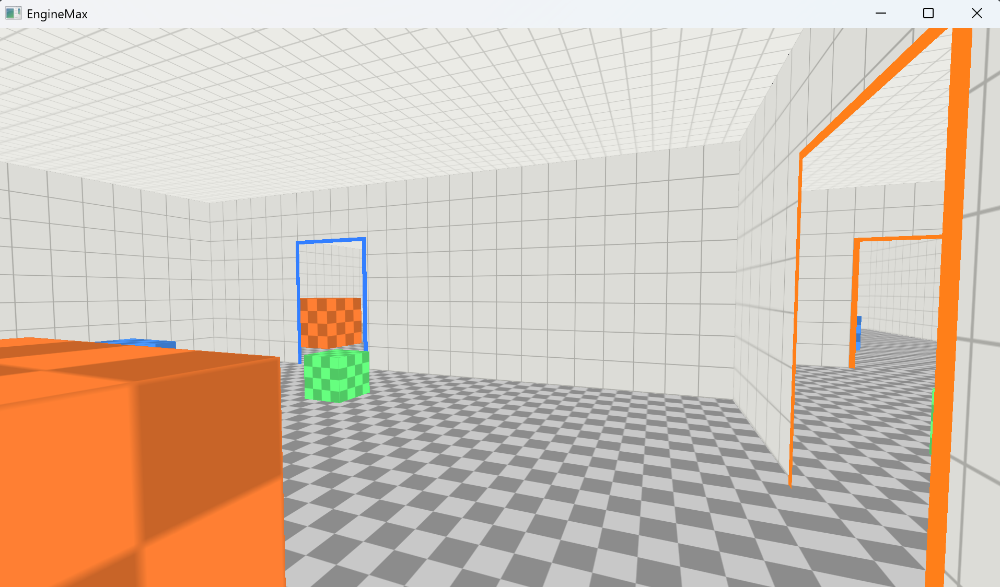
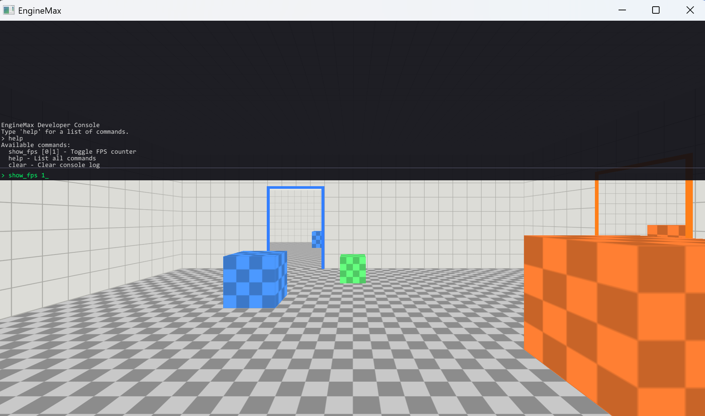

# EngineMax

A custom 3D game engine built from scratch in C++17 and OpenGL 3.3, featuring a Portal-inspired rendering system with recursive see-through portals and seamless walk-through teleportation.




## Overview

EngineMax is a from-scratch game engine focused on implementing portal rendering techniques similar to Valve's Portal. The engine handles all rendering, physics, input, and UI without relying on any high-level game framework -- just raw OpenGL, GLFW for windowing, and GLM for math.

The portal system uses a multi-pass stencil buffer pipeline where each portal renders the scene from a virtual camera at the linked destination, then composites the result into the main view using screen-space UV sampling. Portals are fully recursive: looking through one portal, you can see the second portal rendering the correct view through itself.

## Features

- **Portal Rendering** -- Stencil-masked, FBO-based portal views with virtual camera transforms, oblique near-plane clipping, and second-level recursive rendering (portals visible through portals)
- **Portal Teleportation** -- Seamless player teleportation on portal plane crossing with position/orientation transforms, velocity preservation, and signed-distance tracking
- **FPS Camera** -- Mouse-look with WASD movement, grounded movement with gravity and jumping
- **Physics** -- AABB collision detection and resolution against walls, floor, ceiling, and scene objects
- **Developer Console** -- Toggle with `~`, supports registered commands, autocomplete with tab, and scrollable output log
- **Text Rendering** -- Font atlas baked at runtime from system fonts using stb_truetype, rendered with orthographic projection and alpha blending

## Tech Stack

| Component | Library / Version |
|-----------|-------------------|
| Language | C++17 |
| Build System | CMake 3.20+ |
| Graphics API | OpenGL 3.3 Core Profile |
| GL Loader | GLAD 2 (vendored) |
| Windowing / Input | GLFW 3.4 (FetchContent) |
| Math | GLM 1.0.1 (FetchContent) |
| Font Rendering | stb_truetype (vendored) |

## Project Structure

```
src/
  main.cpp             Entry point, scene setup, render loop, portal pipeline
  shader.h / .cpp      Shader compilation, linking, and uniform helpers
  camera.h / .cpp      FPS camera with mouse look and keyboard movement
  physics.h / .cpp     AABB overlap testing and collision resolution
  portal.h / .cpp      Portal struct, FBO/texture setup, virtual camera math
  text_renderer.h/.cpp stb_truetype atlas baking, 2D text and rect drawing
  console.h / .cpp     Developer console with command registration and autocomplete
external/
  glad/                GLAD 2 OpenGL 3.3 core loader (generated)
  stb/                 stb_truetype single-header library
```

## Building

Requires CMake 3.20+, a C++17 compiler, and an OpenGL 3.3 capable GPU. GLFW and GLM are fetched automatically.

```bash
cmake -S . -B build -G "Visual Studio 17 2022" -A x64
cmake --build build --config Debug
build\Debug\EngineMax.exe
```

## How the Portal Rendering Works

The render loop executes three scene passes per frame:

1. **Portal A FBO Pass** -- Render the scene from portal A's virtual camera into a framebuffer texture. This pass includes second-level rendering: portal B is stencil-masked within this FBO and filled with a deeper virtual camera view.

2. **Portal B FBO Pass** -- Same process from portal B's perspective, with portal A rendered recursively inside.

3. **Main Pass** -- Render to the screen using a stencil pipeline:
   - Mark each portal's screen area in the stencil buffer using the portal quad geometry
   - Render the full scene; objects closer than the portal surface clear the stencil (they're in front of the portal and should be visible)
   - Fill remaining stencil-marked pixels with the corresponding FBO texture using screen-space UV sampling
   - Draw colored border frames at the portal edges

The virtual camera transform computes where the player would be if they stepped through the source portal and emerged from the destination:

```
portalView = playerView * srcModel * rotate180Y * inverse(dstModel)
```

Wall geometry has physical holes cut where portals are placed, so no wall surface can bleed through the portal opening regardless of viewing angle.

## Controls

| Key | Action |
|-----|--------|
| W / A / S / D | Move |
| Mouse | Look |
| Space | Jump |
| ~ | Toggle developer console |

## Console Commands

| Command | Description |
|---------|-------------|
| `show_fps [0\|1]` | Toggle the FPS counter |
| `help` | List all available commands |
| `clear` | Clear the console log |
